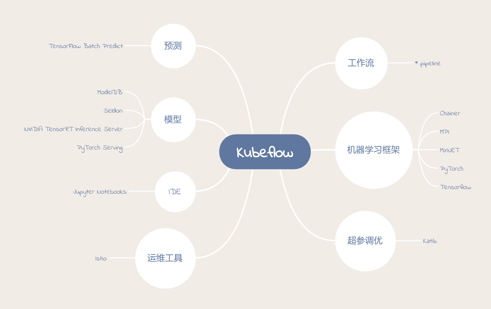

# 再谈 Kubeflow

在 [Kubeflow](Kubeflow.md) 中， 已经介绍了 `Kubeflow` 的安装， 那么在使用前，我们应该先知道 `Kubeflow` 是什么， 以及可我们为什么需要使用 `Kubeflow` 。

那么这一次我尝试从我的角度来谈一谈这个。

## Kubeflow 是什么

对于 [官网](https://www.Kubeflow.org/docs/about/Kubeflow/#what-is-Kubeflow) 的定义:

> Kubeflow is the machine learning toolkit for Kubernetes.

我们可以看出 `Kubeflow` 是一个基于 `kubernetes` 的机器学习工具集。 这也就说明了对于 `Kubeflow` , 我们应该认识到几点：

1. `Kubeflow` 是基于 `Kubernetes` 的， 也就是说我们应该在 `Kubernetes` 上使用 `Kubeflow` 。

2. 同时 `Kubeflow` 的基础是 `Kubernetes`， 其中很多实现的原理都是 `Kubernetes`， 所以了解 `Kubernetes` 对于 `Kubeflow` 会有很大的益处。

3. 最为关键的是， `Kubeflow` 只是个工具集， 本身并不提供任何的功能。 而是通过 `Kubeflow` 部署的各种工具帮助我们进行机器学习。 所以我们应该着眼于 `Kubeflow` 中的各种工具。

那么接下来我们就来看一下 `Kubeflow` 中究竟有哪些工具。

## Kubeflow 中的工具

首先我试着整理了一下 `Kubeflow` 中的工具， 参照下图：

根据上面的图，我们来分别说明一下其中几个工具的作用：

### pipeline

在上图，我们可以看到 `pipeline` 的前面有个 * ， 这是因为在 `Kubeflow v0.1.3` 之后， `pipeline` 已经成为了 `Kubeflow` 的核心组件了。

1. `pipieline` 为什么能成为 `Kubeflow` 的核心组件？

这就要说到 `Kubeflow` 这个项目的成立目的了。`Kubeflow` 主要是为了简化在 `Kubernetes` 上面运行机器学习任务的流程， 最终希望能够实现一套完整可用的流水线, 来实现机器学习从数据到模型的一整套端到端的过程。 所以从这个层面来说，`pipeline` 能够成为 `Kubeflow` 的核心组件一点也不意外。

2. `pipeline` 是什么？

`pipeline` 是一个工作流平台，能够编译部署机器学习的工作流。对于其功能和目标可以前往 [官网](https://www.kubeflow.org/docs/pipelines/pipelines-overview/#what-is-a-pipeline)。 这次我们就不过多的说明这些了。

`pipeline` 的最终显示效果如下图：

3. `pipeline` 是如何工作的呢？

在上图我们可以看到， pipeline最终建立的是一个工作流，工作流的原理就是，每一个组件都定义好自己的输入和输出，然后根据输入和输出关系确定工作流的流程。所以工作流的方式对于组件的复用可以起到很好的作用。

### Chainer, MPI, Tensorflow, PyTorch, MXNET

对于机器学习框架，每一个都有很多的内容可以说。也都有对应的文档可以参考，所以由于文章关注点不在于此，所以这里就不在赘述。

### Katib

对于模型的超参调优，一直都是非常重要的内容。所以 `Kubeflow` 集成了一个超参调优工具 `Katib` 。 值得一提的是， `Katib` 并不依赖于特定的机器学习框架。

通过指定超参的类型和范围， `Katib` 会跑许多个训练任务，并保存它们的结果。

### Istio

如果对 `CNCF` 的比较感兴趣的话，可以知道 `Istio` 是一个非常有名的服务网格。 而 `Kubeflow` 主要利用 `Istio` 来进行资源的管理和进行运维， 例如查看相关资源的指标， 权限的验证， 资源的分配和测试等等。 这样对于我们运行和维护起来会更加方便。

### 模型，预测和IDE

这些都是为了方便机器学习的科学家和工程师们提供的工具，由于个人的理解有限，就不在此多做描述了。具体的可以参考 `Kubeflow` 官网或者相应的组件官网。

## Kubeflow的服务对象

看完上面这些，我们可以大致了解 `Kubeflow` 的服务对象其实是希望在 `Kubernetes` 上部署机器学习任务的科学家或者工程师。所以虽然 `Kubeflow` 提供了很多有用的工具，但是并不适用于所有的机器学习场景。而且 `Kubeflow` 主要关注于训练的过程， 对于其他方面，则应该找寻更为合适的框架或者平台。

## 最后

`Kubeflow` 目前还是比较新的项目，还有很多可以优化的。例如更加方便的使用方式，统一的界面管理等等， 但是对于想要接触开源项目以及想要了解 `Kubernetes` 的人来说，都是一个很不错的项目。可以去看一看或者使用一下试试。